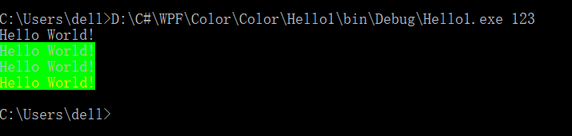
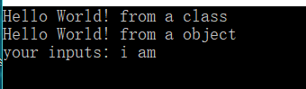
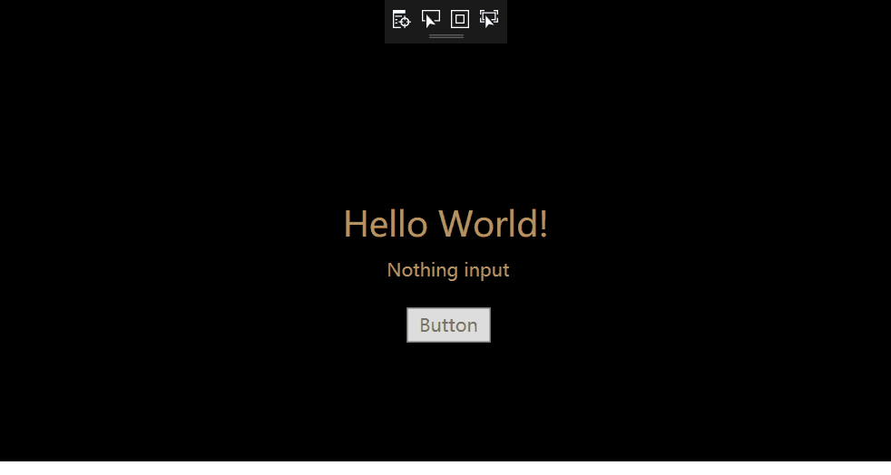
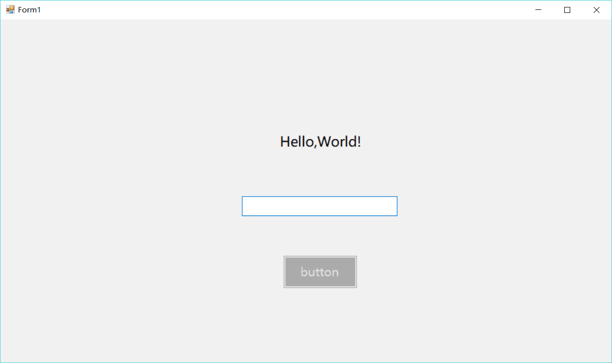
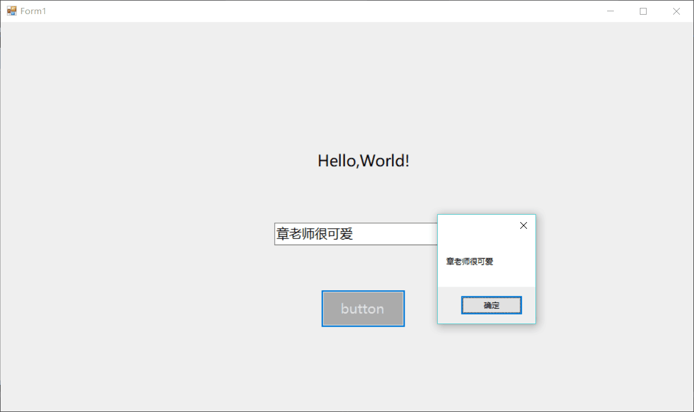
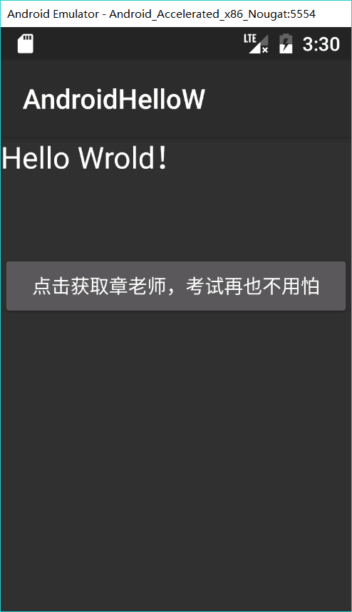

# My C# home Work
1. Color 

   add `Console.ResetColor()`

   

   ​

2. Hello 

   * 新建.NET Framework 创建一个类，并给这个类写一个打印`Hello World！`的方法，最后实例化这个类。获取命令行输入并打印前两个字符串

     

   * 新建.NET Framework 项目，创建一个类，并给这个类写一个打印`Hello World！`静态方法，通过类来调用。获取命令行输入并打印前两个字符串

     

   * 新建WPF项目，加入两个`textbox`和一个并修改样式。在MainWindow.xaml.cs文件中获取命令行参数，并渲染在HelloWorld界面。

     

     * 添加了一个Button之后，点击Button触发函数，调出Windows的MessageBox

       

       

   * 新建窗体应用，拖入两个`TextBox`,一个显示`Hello World！`； 再拖入一个`Button`，当另一个文字输入框输入并点击button时，触发click函数，并显示用户输入的文字，默认显示`Hello World！`

     

     

   * 新建android空白应用，在设计器里面加入一个`TextView`和一个`Button` ，通过id获取这两个组件的实例，在active里面写一个Lamda表达式，监听button的click事件，改变TextView里面的文字。

     

.png)

