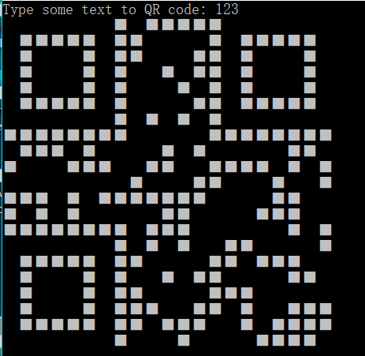
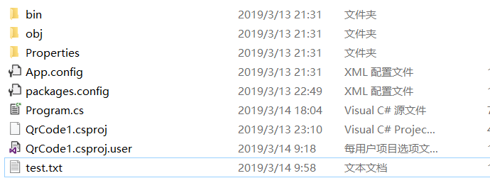
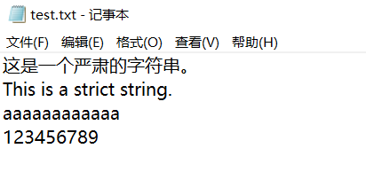
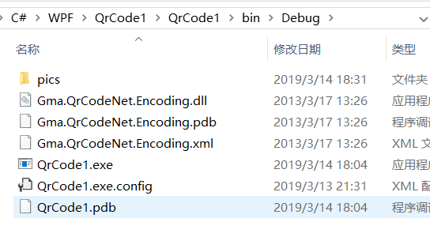
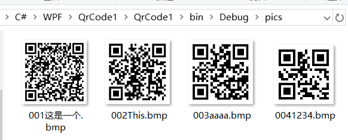
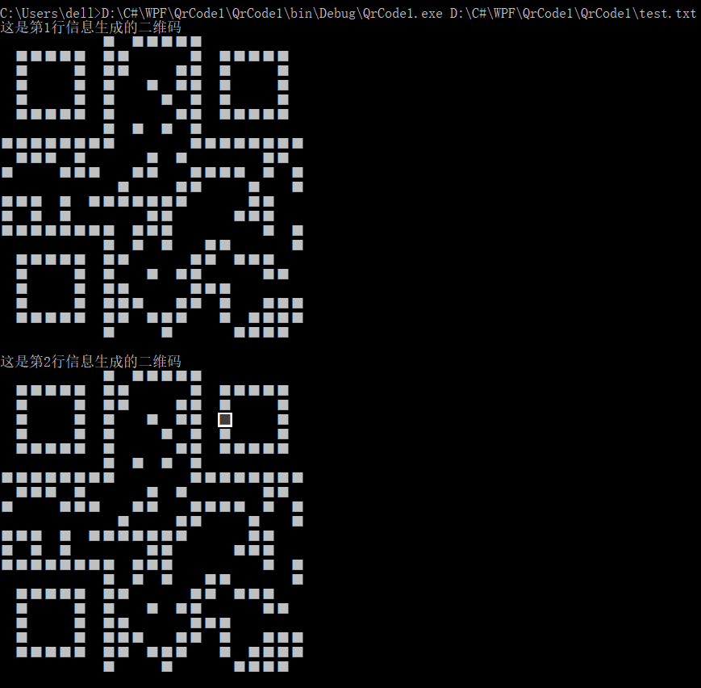
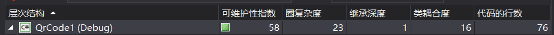
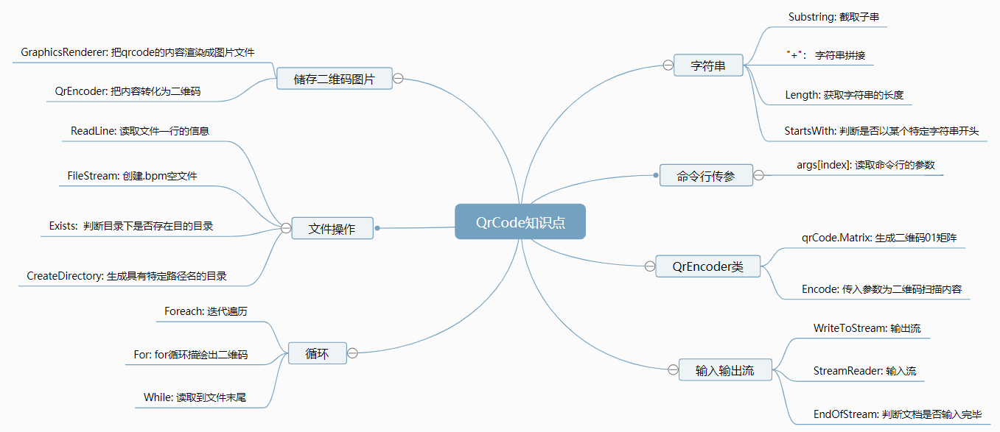

## 
\<\<C#控制台编程\>\>实验报告

学院：软件工程		班级：一班		学号：3017218059		姓名：李思思

日期：2019年3月14号

####一：功能概述

该项目编译成的应用程序为一个控制台应用程序。可生成扫描出输入字符，文件内部字符的二维码，且输入适当的参数可生成相应的二维码图片。

#### 二：项目特色

1. 当用户在命令行输入参数时，判断参数是否是QrCode可以生成的信息，长度是否符合本程序的基本要求（自定义长度），如果符合要求就直接产生QrCode的结果，将QrCode的编码矩阵在控制台屏幕上输出对应黑、白字符方块组成的QrCode码。

2. 如果不符合要求，提示用户输入正确的命令行信息，运行结束。

3. 在用命令行执行时，可根据输入的参数进行判断，并产生不同的执行结果：

   1） 执行时不带参数

   * 提示用户输入字符，并生成相应的二维码。

     

   * 用户输入非法字符，提示用户输入正确的二维码（本项目规定输入字符串长度超过20，为非法字符串）。

     

   2）执行时带参数

   * 携带的参数字符串以`-f`开始，后面接一个文件地址，文件中的每一条字符串信息，将用于生成对应的二维码图片，图片格式为bmp, 并在应用程序所在的目录下自动创建一个pic文件夹，用于储存这些二维码图片。二维码图片的命名规则为：信息所在行号三位数 + 信息的前四个字符构成。如信息所在的行号不够三位数，向高位自动补零；如信息所包含的字符不够四个，则以‘？’补齐。

     * 文件夹目录结构，test.txt为测试文件。

       

     * test.txt展开。

       

     * 执行过程。

       

     * 执行结果。

       

       

   * 携带的参数字符串为普通的文件地址。文件中的每一条字符串信息，将用于生成对应的二维码。二维码将即时在控制台中打印出来。

     - 执行过程及结果。

       

   3）执行时带多个参数

   * 将后面的参数合并成一个文件名，如果找不到该文件，则退出程序。

#### 三：代码总量

#### 四：工作时间：大概6hours

#### 五：知识点总结图

#### 六：结论

用QrCode.NET可方便快速绘制会各种要求的二维图，但对编码会有一些特殊的限制，需要人为控制

