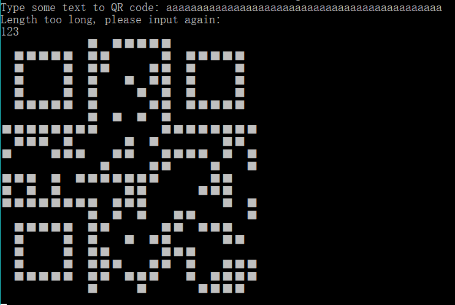
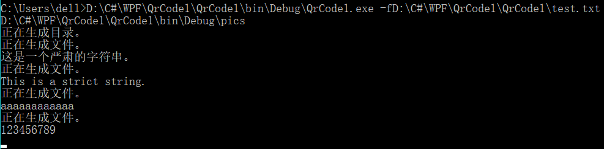
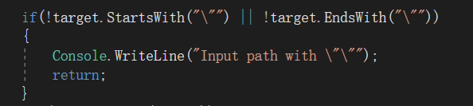

###QrCode.NET

####一：QrCode.NET实现项目简介

该项目编译成的exe程序为一个控制台应用程序。可生成扫描出输入字符，文件内部字符的二维码，且输入适当的参数可生成相应的二维码图片。具体操作如下。

#### 二：项目运行规则介绍

1. 执行时不带参数

   * 提示用户输入字符，并生成相应的二维码。

     

   * 用户输入非法字符，提示用户输入正确的二维码（本项目规定输入字符串长度超过20，为非法字符串）。

     

2. 执行时带一个参数

   * 携带的参数字符串以`-f`开始，后面接一个文件地址，文件中的每一条字符串信息，将用于生成对应的二维码图片，图片格式为bmp, 并在应用程序所在的目录下自动创建一个pic文件夹，用于储存这些二维码图片。二维码图片的命名规则为：信息所在行号三位数 + 信息的前四个字符构成。如信息所在的行号不够三位数，向高位自动补零；如信息所包含的字符不够四个，则以‘？’补齐。

     * 文件夹目录结构，test.txt为测试文件。

       

     * test.txt展开。

       

     * 执行过程。

       

     * 执行结果。

       

       

     * 扫一下，可以扫出来哟~

   * 携带的参数字符串为普通的文件地址。文件中的每一条字符串信息，将用于生成对应的二维码。二维码将即时在控制台中打印出来。

     * 执行过程及结果。

       

3. 执行时带多个参数

   * 只取第一个参数。

####三：特殊实现

1. 生成空的.bmp文件，向其中写入二维码图片信息。使用`using`自动释放资源。

   

2. 使用了`String`类的`StartsWith`方法和`Substring`方法判断输入的参数。比较优雅。

   

3. 规定输入流的编码为`UTF-8`,保证能读取文本文件中的中文。

   

4. 获取执行文件所在目录，方便以为在目标文件下创建储存二维码的文件夹。

   

5. 将文件夹中的每行都输出成图片并保存

   

6. 异常处理（还没太学会，只能手动抛出异常，给出提示信息了）

   * 强制用户输入文件路径应该采用`"c:\Program Files"`格式，即两端用引号包住字符串。

     

   * 检查文件路径是否为非法

     

   (如何生成二维码和如何生成图片就不写进特殊实现了，因为都是调研出来的。官方文档实在难读)

#### 四：遇到的困难

1. 二维码扫描不出来：发现方块没有对齐，黑白方块放反了位置。
2. 找不到一些`using System.Drawing`的引用：解决方案右击->添加->引用->找到目标！
3. 不知道如何生成可以写入的空白图片文件：在code里面瞎试了一下，把生成文件名的后缀改为'.bmp'，瞎猫碰上死耗子，还真生成了一个空白的图片文件。
4. 命令行参数问题：开始把`if(args.Length  >= 1)`当成判断是否有参数输入的条件，在调试的过程中，发现怎么都会进入有参数的代码内部。后来发现，调试的过程中默认会传入两个命令行参数, 判断条件永真。而在控制台执行应用程序时，命令行参数的数量与用户输入参数的数目一致。所以最后把参数改为`if (args.Length  == 1)`则解决了问题。

