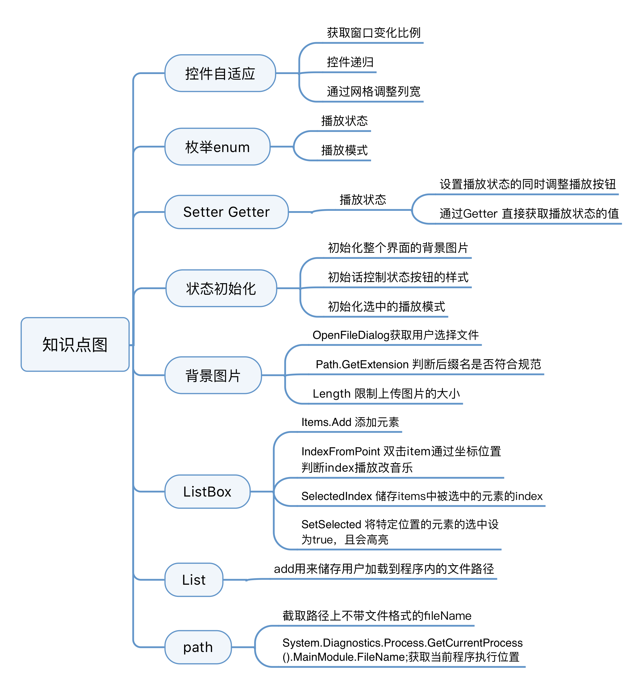

<h3>Windows Form实现MIDI音乐文件的播放APP</h3>

学院: 软件学院   班级: 1班   学号: 3017218059   姓名: 李思思

日期 ：2019年4月4日

#### 一、功能概述

该项目引用了`Sanford.Multimedia.Midi`这个midi文件播放库，对该项目进行了自适应处理，并对其功能做了一点的扩展，如添加了播放模式和播放列表，并将功能按钮进行了合并

#### 二、项目特色

1. 实现控件的自适应

   通过记录空间的位置，窗口的缩放比例和递归控件，实现空间随着窗口的缩放而缩放

2. 自由设置背景

   用户可自由上传图片作为程序的背景

3. 选择播放模式

   有三种播放模式可供选择，包括：

   * repeat：循环播放
   * order：顺序播放
   * random：随机播放

4. 操作播放列表

   * 添加
   * 当前播放位置高亮
   * 点击播放

5. 功能按钮的合并

   * play
   * stop
   * loaded

#### 三、代码总量

#### 四、工作时间

3天

#### 五、知识点总结图

#### 六、结论

通过记录空间的位置，窗口的缩放比例和递归控件，能够很好的实现控件的自适应。该midi库提供了充足的回调方法用来扩展功能，但是对于线程这部分处理得不是很完美，因此可能会存在一些线程冲突的问题，这方面的知识需要多多学习。

