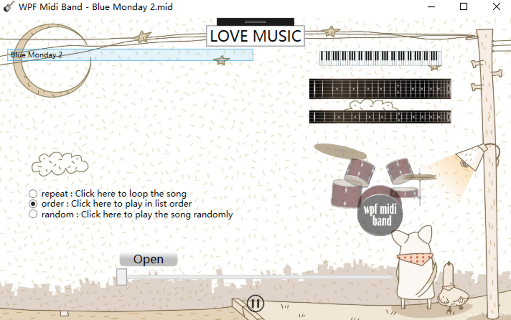
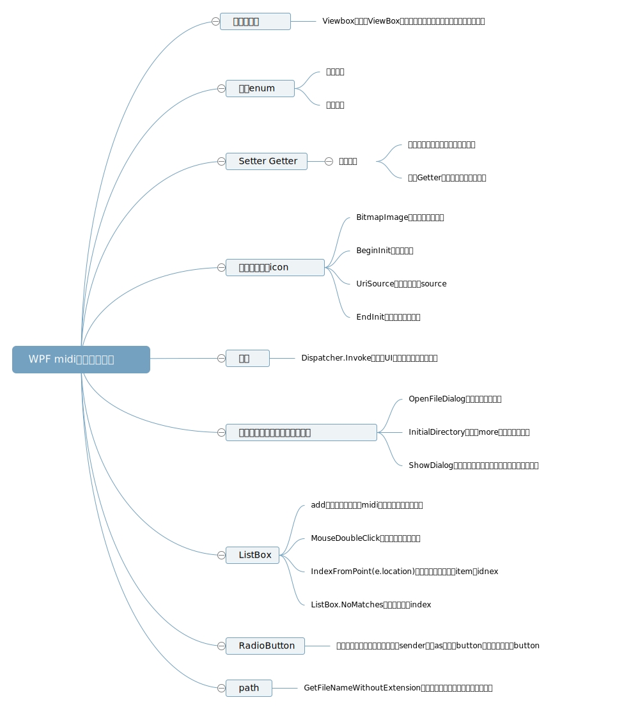

<h3>WPF实现MIDI乐队APP</h3>

学院: 软件学院   班级: 1班   学号: 3017218059   姓名: 李思思

日期 ：2019年4月13日

#### 一、功能概述

该项目引用了`WPFMidiBandWPF`的midi文件播放器项目，对该项目进行了自适应处理，并对其功能做了一些的扩展，如添加了播放模式和播放列表，并将功能按钮进行了合并

#### 二、项目特色

1. 实现控件的自适应

   通过使用WPF自带的Viewbox实现了控件的自适应，从而使得控件的大小随着页面大小的变化而变化。

2. 对原项目重新布了局

   将主页面移到了页面的右半边，将播放进度和播放控制按钮移到了页面下面。

   

3. 选择播放模式

   有三种播放模式可供选择，包括：

   - repeat：循环播放
   - order：顺序播放
   - random：随机播放

4. 操作播放列表

   - 从open按钮那里添加
   - 当前播放位置高亮
   - 点击播放

5. 功能按钮的合并

   去掉了原来的start、stop和continue按钮，添加了在播放和暂停之间切换的icon代表播放的状态。

   - play
   - stop

#### 三、代码总量

#### 四、工作时间

一周

#### 五、知识点总结图

#### 六、结论

在WPF项目中使用Viewbox可以拉伸或延展位于其中的组件，使之有很好的布局及视觉效果。基本达到到本次实验的要求。初次之外，所有对UI的更新都应该通过Dispatcher.Invoke delegate给主线程处理。通过使用Page可以很好的实现分页功能，但是对于一个功能比较统一的项目，还是应该统一在一个页面，但是可以通过使用下拉列表DropItems隐藏列表。