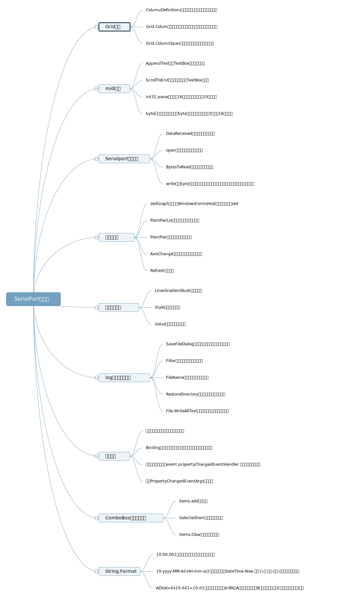

<h3>C#.NET 综合应用程序开发</h3>
 

学院: 软件学院   班级: 1班   学号: 3017218059   姓名: 李思思

日期 ：2019年4月22日

#### 一、功能概述

该项目实现了一个基于MIDI通信协议的控制Arduino的WPF应用程序。通过应用程序可以直接连接Arduino，并对其进行温度，光强读取，LED亮度读取和设置等操作，并将Arduino返回的数据显示在界面上。

#### 二、项目特色

1. 实现界面的相对布局，使界面更加友好和美观。

   通过使用Grid布局，实现了相对布局，页面不会随着出窗口的缩放而错位。去除了设计图中寄存器的部分，还将一个曲线图拆分成为了两个。除此之外，在数据接收器下面添加了显示转换后的数据的实时显示区，在数据发送去下面添加了发送数据的按钮。

2. midi数据接收与发送

   在界面接收到arduino发送的三字节命令，界面会显示原命令和将命令解析后的所携带的真实数据。且可以在发送区发送类似`96 00 00`的命令来使arduino执行相应的指令。

3. 显示实时的温度和光强值，并且绘制对应的折线图。

   通过使用WPF的控件`zedgraph`，绘制实时的光强和温度值。通过改变透过光强传感器的光强或者温度传感器的温度，可以实时在应用程序上看见折线的变化。

4. 滑动条设置LED亮度

   添加`Slider`控件，可以通过滑动不同颜色的滑条，设置LED的亮度值。

5. log文件保存到本地

   点击log后，应用自动保存arduino发送过来的midi指令，在log结束时，打开文件选择器，让用户选择文件或者重新生成一个文件，文件的默认名称为当前的时间的`log-{0:yyyy-MM-dd-HH-mm-ss}.txt`格式。

#### 三、代码总量

#### 四、工作时间

一周

#### 五、知识点总结图

#### 六、结论

通过C#封装好的SerialPort类，可以很轻松的实现单片机和PC端的通信。波特率对于维护二者的通信特别重要，如果设置不一致会导致无法互相接收指令。在Arduino端会存在一个处理指令的时延和一个接收数据的缓存池，导致在大量进行通信的该过程时，arduino可能无法立刻处理来自PC端的指令。WPF中可以使用一些WindosForm的控件，兼容性比较高。通过在xaml文件中定义resource，可以实现对一些控件的特殊定制。